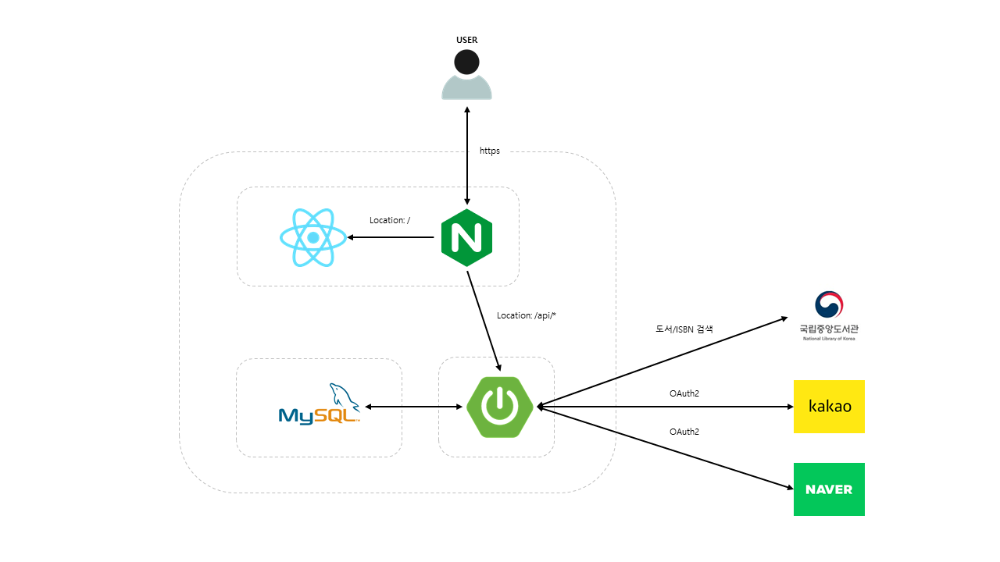
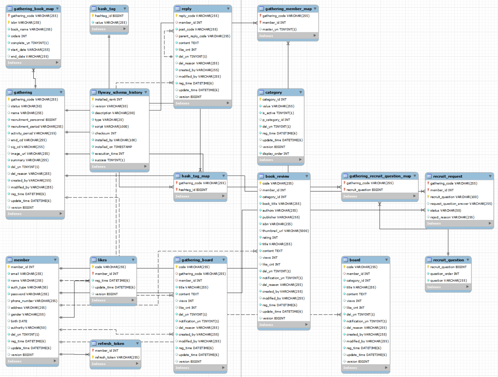

# BookTalk\_BE

독서 모임 커뮤니티 플랫폼의 백엔드 서버. 게시판·서평·댓글·독서 모임 CRUD와 관리자 제재/복구 기능을 제공하며, 100만 건 이상 데이터 환경에서의 조회 성능 최적화에 집중한 프로젝트입니다.


---

## Architecture


---

## 주요 기능 및 기술 결정

| 기능 | 요약 |
| --- | --- |
| QueryDSL 동적 검색 | `BooleanBuilder`로 null-safe 조건 조합, `Projections.fields()`로 필요한 컬럼만 SELECT, COUNT 쿼리 분리로 불필요한 JOIN 제거 |
| 계층형 댓글 트리 | DB 플랫 조회 후 `Map<replyCode, ReplyResponse>` 기반 2-Pass로 트리 조립, O(n²) → O(n) 개선 및 N+1 제거 |
| Caffeine 로컬 캐시 | 관리자 목록 COUNT 쿼리 병목을 TTL 30초 캐시로 해소, CUD·제재·복구 시 `@CacheEvict(allEntries=true)` 자동 무효화 |
| 복합 인덱스 설계 | `EXPLAIN ANALYZE` 기반 WHERE + ORDER BY 컬럼 조합 인덱스 13개, 한국어 키워드 검색은 ngram FULLTEXT 인덱스 적용 |
| Soft Delete + 관리자 제재 | `del_yn` 논리 삭제로 이력 보존, 모든 조회 인덱스에 포함해 삭제 행 스캔 제외, 관리자 복구까지 지원 |
| 낙관적 락 | `CommonTimeEntity`에 `@Version` 선언으로 Board·BookReview·Gathering 등 전 엔티티에 자동 적용 |

---

## 데이터 모델


---

## Getting Started

### 사전 요구사항

- Java 17+
- Docker (MySQL 컨테이너용)

### 1. MySQL 컨테이너 실행

```bash
docker create --name booktalk-mysql \
  -e MYSQL_ROOT_PASSWORD=root \
  -p 3306:3306 \
  mariadb:latest

docker start booktalk-mysql

docker exec -it booktalk-mysql mariadb -uroot -proot \
  -e "CREATE DATABASE IF NOT EXISTS booktalk;"
```

### 2. 환경 설정 파일 생성

`src/main/resources/application-dev.yml` 파일을 아래 템플릿을 참고해 작성합니다.

```yaml
spring:
  datasource:
    url: jdbc:mysql://localhost:3306/booktalk?useSSL=false&allowPublicKeyRetrieval=true&serverTimezone=Asia/Seoul
    username: root
    password: root
    driver-class-name: com.mysql.cj.jdbc.Driver

  jpa:
    hibernate:
      ddl-auto: validate

  flyway:
    enabled: true
    locations: classpath:db/migration
    baseline-on-migrate: true

  security:
    oauth2:
      client:
        registration:
          kakao:
            client-id: {KAKAO_CLIENT_ID}
            client-secret: {KAKAO_CLIENT_SECRET}
            redirect-uri: http://localhost:8080/login/oauth2/code/kakao
            scope: account_email
          naver:
            client-id: {NAVER_CLIENT_ID}
            client-secret: {NAVER_CLIENT_SECRET}
            redirect-uri: http://localhost:8080/login/oauth2/code/naver
            scope: name, email, profile_image

jwt:
  issuer: "my-app-auth-server"
  secretAccessKey: {JWT_ACCESS_SECRET}       # 32자 이상 권장
  secretRefreshToken: {JWT_REFRESH_SECRET}   # 32자 이상 권장
  accessExpiration: 3600000                  # 1시간 (ms)
  refreshExpiration: 1209600000              # 14일 (ms)

nlk:
  api:
    key: {NLK_API_KEY}
    base-url: https://www.nl.go.kr/NL/search/openApi/search.do

app:
  worker-id: 0
  upload:
    image-dir: /tmp/booktalk/uploads
    url-prefix: /uploads
```

> **OAuth2, NLK API 키 발급**
> - 카카오: [developers.kakao.com](https://developers.kakao.com)
> - 네이버: [developers.naver.com](https://developers.naver.com)
> - 국립중앙도서관 API: [www.nl.go.kr](https://www.nl.go.kr/NL/contents/N31101030000.do)

### 3. 실행

```bash
# Q클래스 생성 + 빌드
./gradlew clean compileJava

# 서버 실행 (Flyway 마이그레이션 자동 적용)
./gradlew bootRun --args='--spring.profiles.active=dev'
```

서버가 뜨면 Flyway가 V1~V6 마이그레이션을 자동으로 실행합니다.

### API 문서

```
http://localhost:8080/swagger-ui/index.html
```

---

## 프로젝트 구조

```
src/main/java/com/booktalk_be/
├── domain/
│   ├── auth/          # JWT 발급·검증, OAuth2 소셜 로그인
│   ├── board/         # 커뮤니티 게시판 CRUD + 관리자 제재/복구
│   ├── bookreview/    # 도서 서평 (ISBN·평점 포함)
│   ├── reply/         # 댓글·대댓글 (계층형 트리 변환)
│   ├── gathering/     # 독서 모임 모집·관리·가입신청
│   ├── member/        # 회원 (LOCAL·KAKAO·NAVER 인증 타입)
│   ├── category/      # 계층형 카테고리 (self-join)
│   ├── likes/         # 게시글·댓글 좋아요
│   ├── dashboard/     # 관리자 대시보드
│   └── nlk/           # 국립중앙도서관 API 도서 검색
├── common/
│   ├── entity/        # CommonEntity → CommonTimeEntity → Post 상속 체계
│   └── utils/         # DistributedIdGenerator (Snowflake 64-bit)
└── springconfig/
    ├── auth/jwt/      # JwtProvider, JwtAuthFilter
    ├── auth/user/     # CustomOAuth2UserService
    ├── CacheConfig    # Caffeine CacheManager (TTL 30s, max 200)
    └── SecurityConfig # 엔드포인트별 인가 규칙
```
