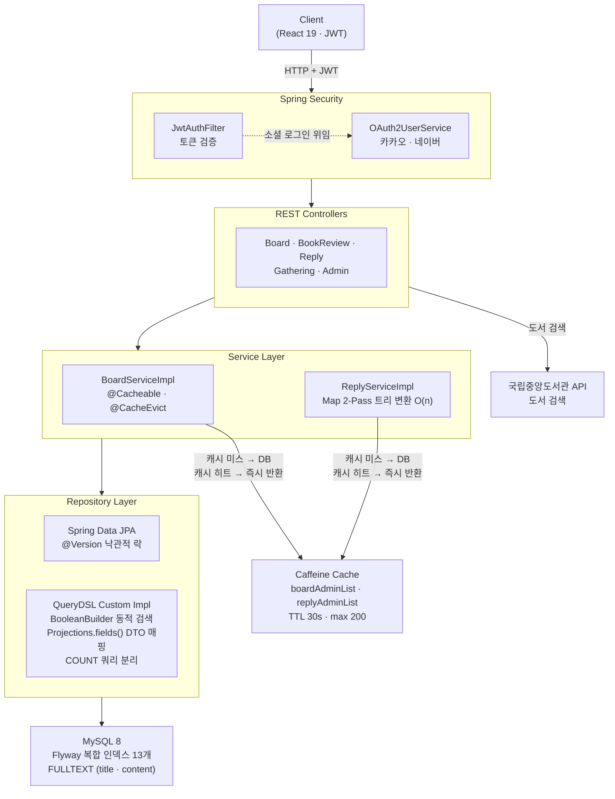
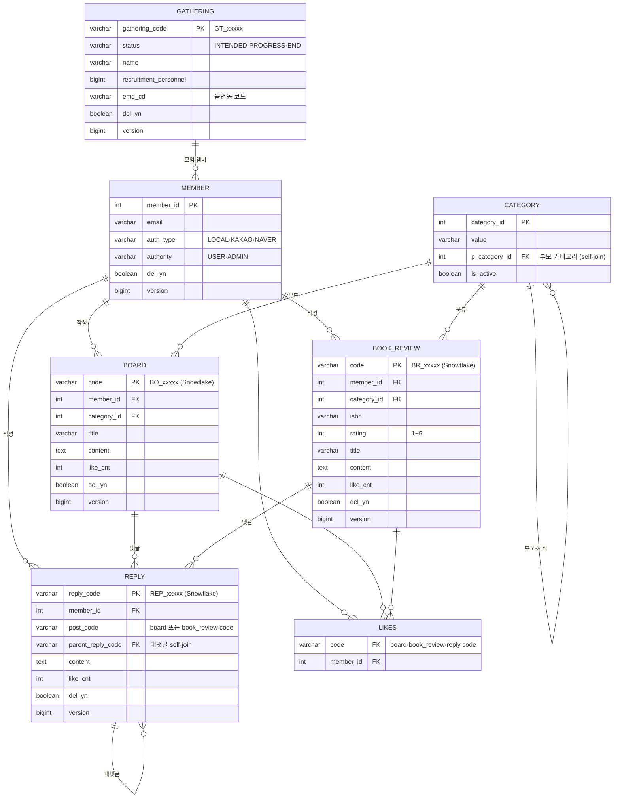

# BookTalk\_BE

독서 모임 커뮤니티 플랫폼의 백엔드 서버. 게시판·서평·댓글·독서 모임 CRUD와 관리자 제재/복구 기능을 제공하며, 100만 건 이상 데이터 환경에서의 조회 성능 최적화에 집중한 프로젝트입니다.


---

## Architecture



---

## 주요 기능 및 기술 결정

### QueryDSL 기반 동적 검색 · 페이지네이션

키워드 타입(제목/작성자/카테고리/코드), 날짜 범위, 삭제 여부 등 조건이 요청마다 달라지는 관리자 검색 API에 정적 JPQL로 대응하면 메서드 조합이 기하급수적으로 늘어납니다. `BooleanBuilder`로 null-safe 조건을 조합하고, 페이지네이션 시 데이터 쿼리와 COUNT 쿼리를 분리해 COUNT에서 불필요한 JOIN을 제거했습니다. `Projections.fields()`로 DTO에 직접 매핑해 엔티티 전체 로딩 없이 필요한 컬럼만 SELECT합니다.

### 계층형 댓글 트리 (Map 2-Pass, O(n))

MySQL의 CTE 재귀 쿼리는 인덱스를 활용하지 못하는 경우가 많고, depth가 3으로 고정된 상황에서 depth별 단순 IN 쿼리가 더 예측 가능합니다. DB에서 플랫하게 조회한 뒤, `Map<replyCode, ReplyResponse>`로 전체 노드를 인덱싱(1-Pass)하고 parentCode로 O(1) 탐색해 자식 리스트에 연결(2-Pass)합니다. 이중 반복문 O(n²)을 O(n)으로 개선하면서 N+1도 배치 IN 쿼리로 제거했습니다.

### Caffeine 로컬 캐시 (관리자 쿼리 전용)

관리자 목록 API는 WHERE 없이 100만~250만 행을 집계하는 COUNT 쿼리가 병목이었습니다. 단일 서버 운영 환경에서 Redis의 네트워크 오버헤드가 불필요하다고 판단해 Caffeine을 선택했습니다. TTL 30초, 최대 200 엔트리로 캐시를 구성하고, 게시글·댓글 CUD 및 제재·복구 이벤트 시 `@CacheEvict(allEntries=true)`로 즉시 무효화합니다.

### 인덱스 설계 및 Flyway 버전 관리

`EXPLAIN ANALYZE`로 쿼리 패턴을 분석한 뒤, WHERE 조건 컬럼과 ORDER BY 컬럼을 묶어 복합 인덱스 13개를 설계했습니다. 인덱스를 Flyway 마이그레이션 스크립트로 관리해 개발·운영 환경 간 스키마 일관성을 보장합니다. 한국어 키워드 검색에는 ngram 파서 기반 FULLTEXT 인덱스를 적용했습니다.

### Soft Delete + 관리자 제재/복구

게시글·댓글을 물리 삭제하면 이력이 사라지고 복구가 불가능합니다. `del_yn` 컬럼으로 논리 삭제를 처리하고, 모든 조회 인덱스에 `del_yn`을 포함해 삭제된 행이 스캔에서 제외되도록 했습니다. 관리자는 제재 사유 기록 후 복구까지 가능하며, `@CacheEvict`가 제재·복구 시에도 적용돼 캐시와 실제 상태가 항상 일치합니다.

### @Version 낙관적 락

좋아요, 조회수처럼 동시 요청이 몰리는 필드는 비관적 락을 걸면 대기가 쌓입니다. `CommonTimeEntity`에 `@Version`을 선언해 Board, BookReview, Gathering 등 모든 하위 엔티티에 낙관적 락이 자동 적용됩니다.

---

## 데이터 모델



---

## Getting Started

### 사전 요구사항

- Java 17+
- Docker (MySQL 컨테이너용)

### 1. MySQL 컨테이너 실행

```bash
docker create --name booktalk-mysql \
  -e MYSQL_ROOT_PASSWORD=root \
  -p 3306:3306 \
  mariadb:latest

docker start booktalk-mysql

docker exec -it booktalk-mysql mariadb -uroot -proot \
  -e "CREATE DATABASE IF NOT EXISTS booktalk;"
```

### 2. 환경 설정 파일 생성

`src/main/resources/application-dev.yml` 파일을 아래 템플릿을 참고해 작성합니다.

```yaml
spring:
  datasource:
    url: jdbc:mysql://localhost:3306/booktalk?useSSL=false&allowPublicKeyRetrieval=true&serverTimezone=Asia/Seoul
    username: root
    password: root
    driver-class-name: com.mysql.cj.jdbc.Driver

  jpa:
    hibernate:
      ddl-auto: validate

  flyway:
    enabled: true
    locations: classpath:db/migration
    baseline-on-migrate: true

  security:
    oauth2:
      client:
        registration:
          kakao:
            client-id: {KAKAO_CLIENT_ID}
            client-secret: {KAKAO_CLIENT_SECRET}
            redirect-uri: http://localhost:8080/login/oauth2/code/kakao
            scope: account_email
          naver:
            client-id: {NAVER_CLIENT_ID}
            client-secret: {NAVER_CLIENT_SECRET}
            redirect-uri: http://localhost:8080/login/oauth2/code/naver
            scope: name, email, profile_image

jwt:
  issuer: "my-app-auth-server"
  secretAccessKey: {JWT_ACCESS_SECRET}       # 32자 이상 권장
  secretRefreshToken: {JWT_REFRESH_SECRET}   # 32자 이상 권장
  accessExpiration: 3600000                  # 1시간 (ms)
  refreshExpiration: 1209600000              # 14일 (ms)

nlk:
  api:
    key: {NLK_API_KEY}
    base-url: https://www.nl.go.kr/NL/search/openApi/search.do

app:
  worker-id: 0
  upload:
    image-dir: /tmp/booktalk/uploads
    url-prefix: /uploads
```

> **OAuth2, NLK API 키 발급**
> - 카카오: [developers.kakao.com](https://developers.kakao.com)
> - 네이버: [developers.naver.com](https://developers.naver.com)
> - 국립중앙도서관 API: [www.nl.go.kr](https://www.nl.go.kr/NL/contents/N31101030000.do)

### 3. 실행

```bash
# Q클래스 생성 + 빌드
./gradlew clean compileJava

# 서버 실행 (Flyway 마이그레이션 자동 적용)
./gradlew bootRun --args='--spring.profiles.active=dev'
```

서버가 뜨면 Flyway가 V1~V6 마이그레이션을 자동으로 실행합니다.

### API 문서

```
http://localhost:8080/swagger-ui/index.html
```

---

## 프로젝트 구조

```
src/main/java/com/booktalk_be/
├── domain/
│   ├── auth/          # JWT 발급·검증, OAuth2 소셜 로그인
│   ├── board/         # 커뮤니티 게시판 CRUD + 관리자 제재/복구
│   ├── bookreview/    # 도서 서평 (ISBN·평점 포함)
│   ├── reply/         # 댓글·대댓글 (계층형 트리 변환)
│   ├── gathering/     # 독서 모임 모집·관리·가입신청
│   ├── member/        # 회원 (LOCAL·KAKAO·NAVER 인증 타입)
│   ├── category/      # 계층형 카테고리 (self-join)
│   ├── likes/         # 게시글·댓글 좋아요
│   ├── dashboard/     # 관리자 대시보드
│   └── nlk/           # 국립중앙도서관 API 도서 검색
├── common/
│   ├── entity/        # CommonEntity → CommonTimeEntity → Post 상속 체계
│   └── utils/         # DistributedIdGenerator (Snowflake 64-bit)
└── springconfig/
    ├── auth/jwt/      # JwtProvider, JwtAuthFilter
    ├── auth/user/     # CustomOAuth2UserService
    ├── CacheConfig    # Caffeine CacheManager (TTL 30s, max 200)
    └── SecurityConfig # 엔드포인트별 인가 규칙
```
